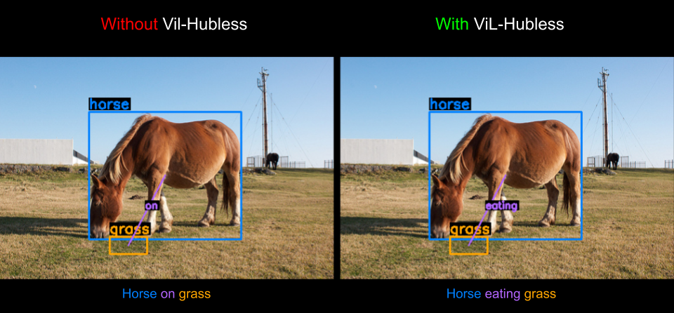
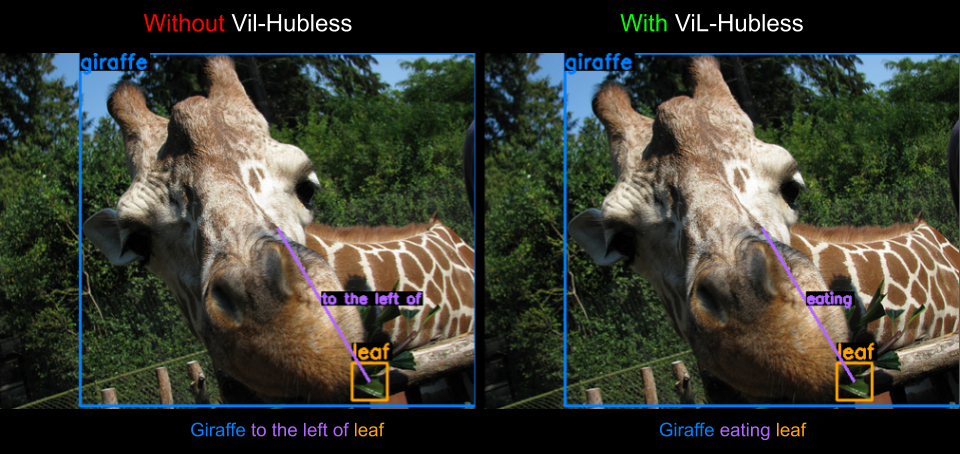

# Long-tail Visual Relationship Recognition with a Visiolinguistic Hubless Loss (LTVRR)
Watch our video below:

[](https://youtu.be/_3pYM3xEhV0)



<p align="center">Example results from the GQA dataset.</p>

This is a PyTorch implementation for [Long-tail Visual Relationship Recognition]().

This code is for the GQA and VG8K datasets. 

We borrowed the framework from [Detectron.pytorch](https://github.com/roytseng-tw/Detectron.pytorch) and [Large-scale Visual Relationship Understanding](https://github.com/jz462/Large-Scale-VRD.pytorch) for this project, so there are a lot overlaps between these two and ours.

## Benchmarking on GQA
| Method                         |  Backbone         | many     | medium   | few       | all       |
| :---                           |       :----:      |  :----:  |  :----:  |  :----:   |  :----:   |
| Baseline \[1\]                 |  VGG16            | 70.5     | 36.2     | 3.5       | 51.9      |
| Baseline \[1\] + ViLHub        |  VGG16            | 69.8     | **42.1** | **9.5**   | **53.9**  |
| :---                           |       :----:      |  :----:  |  :----:  |  :----:   |  :----:   |
| Focal Loss \[2\]               |  VGG16            | 69.6     | 38.0     | 4.7       | 52.1      |
| Focal Loss \[2\] + ViLHub      |  VGG16            | 69.8	    | **41.7** | **8.1**   | **53.7**  |
| :---                           |       :----:      |  :----:  |  :----:  |  :----:   |  :----:   |
| WCE \[3\]                      |  VGG16            | 39.3	    | 36.5     | 16.2      | **35.5**  |
| WCE + ViLHub \[3\]             |  VGG16            | 35.2	    | **39.5** | **18.8**  | 34.2      |


\[1\] [Zhang et al. "Neural motifs: Scene graph parsing with global context." Proceedings of the IEEE Conference on Computer Vision and Pattern Recognition. 2018.](http://openaccess.thecvf.com/content_cvpr_2018/html/Zellers_Neural_Motifs_Scene_CVPR_2018_paper.html)

\[2\] [Yang, Jianwei, et al. "Graph r-cnn for scene graph generation." Proceedings of the European Conference on Computer Vision (ECCV). 2018.](http://openaccess.thecvf.com/content_ECCV_2018/html/Jianwei_Yang_Graph_R-CNN_for_ECCV_2018_paper.html)

## Requirements
* Python 3
* Python packages
  * pytorch 0.4.0 or 0.4.1.post2 (not guaranteed to work on newer versions)
  * cython
  * matplotlib
  * numpy
  * scipy
  * opencv
  * pyyaml
  * packaging
  * [pycocotools](https://github.com/cocodataset/cocoapi)
  * tensorboardX
  * tqdm
  * pillow
  * scikit-image
  * gensim
* An NVIDIA GPU and CUDA 8.0 or higher. Some operations only have gpu implementation.

An easy installation if you already have Python 3 and CUDA 9.0:
```
conda install pytorch=0.4.1
pip install cython
pip install matplotlib numpy scipy pyyaml packaging pycocotools tensorboardX tqdm pillow scikit-image gensim
conda install opencv
```

## Compilation
Compile the CUDA code in the Detectron submodule and in the repo:
```
cd $ROOT/lib
sh make.sh
```

## Annotations

Create a data folder at the top-level directory of the repository:
```
# ROOT=path/to/cloned/repository
cd $ROOT
mkdir data
```

### GQA
Download it [here](https://drive.google.com/open?id=1kTNiqsLcxfpVysZrzNETAFiPmPrsxBrB). Unzip it under the data folder. You should see a `gvqa` folder unzipped there. It contains seed folder called `seed0` that contains .json annotations that suit the dataloader used in this repo.

### Visual Genome
Download it [here](https://drive.google.com/open?id=1YJrTcOvYt-ebCilIshBb_hCrEQ6u9m1M). Unzip it under the data folder. You should see a `vg` folder unzipped there. It contains seed folder called `seed3` that contains .json annotations that suit the dataloader used in this repo.


### Word2Vec Vocabulary
Create a folder named `word2vec_model` under `data`. Download the Google word2vec vocabulary from [here](https://code.google.com/archive/p/word2vec/). Unzip it under the `word2vec_model` folder and you should see `GoogleNews-vectors-negative300.bin` there.

## Images

### GQA
```
# ROOT=path/to/cloned/repository
cd $ROOT/data/gvqa
mkdir images
```
Download GQA images from the [here](https://cs.stanford.edu/people/dorarad/gqa/download.html)

### Visual Genome
Create a folder for all images:
```
# ROOT=path/to/cloned/repository
cd $ROOT/data/vg
mkdir VG_100K
```
Download Visual Genome images from the [official page](https://visualgenome.org/api/v0/api_home.html). Unzip all images (part 1 and part 2) into `VG_100K/`. There should be a total of 108249 files.

## Pre-trained Object Detection Models
Download pre-trained object detection models [here](https://drive.google.com/open?id=16JVQkkKGfiGt7AUt789pUPX3o84Cl2hL). Unzip it under the root directory and you should see a `detection_models` folder there.

## Our Trained Relationship Detection Models
Download our trained models [here](https://drive.google.com/open?id=12zvgkUjgxAGEE99o0l6rcCCeE4QP4cYZ). Unzip it under the root folder and you should see a `trained_models` folder there.

## Directory Structure
The final directories for data and detection models should look like:
```
|-- data
|   |-- vg
|   |   |-- VG_100K    <-- (contains Visual Genome images)
|   |   |-- seed3    <-- (contains annotations)
|   |   |   |-- rel_annotations_train.json
|   |   |   |-- rel_annotations_val.json
|   |   |   |-- ...
|   |-- gvqa
|   |   |-- images    <-- (contains GQA training images)
|   |   |-- seed0    <-- (contains annotations)
|   |       |-- annotations_train.json
|   |       |-- annotations_val.json
|   |       |-- ...
|   |-- word2vec_model
|   |   |-- GoogleNews-vectors-negative300.bin
|-- trained_models
|   |-- e2e_relcnn_VGG16_8_epochs_vg_y_loss_only
|   |   |-- model_step125445.pth
|   |-- e2e_relcnn_X-101-64x4d-FPN_8_epochs_vg_y_loss_only
|   |   |-- model_step125445.pth
|   |-- e2e_relcnn_VGG16_8_epochs_vrd_y_loss_only
|   |   |-- model_step7559.pth
|   |-- e2e_relcnn_VGG16_8_epochs_vrd_y_loss_only_w_freq_bias
|   |   |-- model_step7559.pth
```

## Evaluating Pre-trained Relationship Detection models

DO NOT CHANGE anything in the provided config files(configs/xx/xxxx.yaml) even if you want to test with less or more than 8 GPUs. Use the environment variable `CUDA_VISIBLE_DEVICES` to control how many and which GPUs to use. Remove the
`--multi-gpu-test` for single-gpu inference.

### GQA
**NOTE:** May require at least 64GB RAM to evaluate on the GQA test set

We use three evaluation metrics:
1. Per-class accuracy (sbj, obj, rel)
1. Overall accuracy (sbj, obj, rel)
1. Overall triplet accuracy
1. Accuracy over frequency bands (many, medium, few, and all)
1. Accuracy over frequency bands (many, medium, few, and all) using synset matching
1. Average word similarity between GT and detection for \[word2vec_gn, word2vec_vg, lch, wup, lin, path, res, jcn] similarities

```
python tools/test_net_rel.py --dataset gvqa --cfg configs/gvqa/e2e_relcnn_VGG16_8_epochs_gvqa_y_loss_only_hubness.yaml --do_val --load_ckpt Outputs/e2e_relcnn_VGG16_8_epochs_gvqa_y_loss_only_hubness/gvqa/Mar11-07-01-07_gpu210-18_step_with_prd_cls_v3/ckpt/best.pth  --use_gt_boxes --use_gt_labels --seed 0
```

### Visual Genome
**NOTE:** May require at least 64GB RAM to evaluate on the Visual Genome test set

We use three evaluation metrics:
1. Per-class accuracy (sbj, obj, rel): predict all the three labels and two boxes
1. Overall accuracy (sbj, obj, rel): predict subject, object and predicate labels given ground truth subject and object boxes
1. Overall triplet accuracy: predict predicate labels given ground truth subject and object boxes and labels
1. Accuracy over frequency bands (many, medium, few, and all): predict predicate labels given ground truth subject and object boxes and labels

```
python tools/test_net_rel.py --dataset vg8k --cfg configs/vg8k/e2e_relcnn_VGG16_8_epochs_vg8k_y_loss_only_hubness.yaml --do_val --load_ckpt Outputs/e2e_relcnn_VGG16_8_epochs_gvqa_y_loss_only_hubness/vg8k/Mar11-07-01-07_gpu210-18_step_with_prd_cls_v3/ckpt/best.pth  --use_gt_boxes --use_gt_labels --seed 0
```

## Training Relationship Detection Models

The section provides the command-line arguments to train our relationship detection models given the pre-trained object detection models described above.

DO NOT CHANGE anything in the provided config files(configs/xx/xxxx.yaml) even if you want to train with less or more than 8 GPUs. Use the environment variable `CUDA_VISIBLE_DEVICES` to control how many and which GPUs to use.

With the following command lines, the training results (models and logs) should be in `$ROOT/Outputs/xxx/` where `xxx` is the .yaml file name used in the command without the ".yaml" extension. If you want to test with your trained models, simply run the test commands described above by setting `--load_ckpt` as the path of your trained models.


### GQA
To train our relationship network using a VGG16 backbone, run
```
python tools/train_net_step_rel.py --dataset gvqa --cfg configs/gvqa/e2e_relcnn_VGG16_8_epochs_vg_y_loss_only.yaml --nw 8 --use_tfboard
```


### Visual Genome
To train our relationship network using a VGG16 backbone, run
```
python tools/train_net_step_rel.py --dataset vg8k --cfg configs/vg8k/e2e_relcnn_VGG16_8_epochs_vg_y_loss_only.yaml --nw 8 --use_tfboard
```


## (Optional) Training Object Detection Models
This repo provides code for training object detectors for Visual Genome using a ResNeXt-101-64x4d-FPN backbone.

First download weights of ResNeXt-101-64x4d-FPN trained on COCO [here](https://drive.google.com/open?id=1HvznYV86YJp6wfNj7ksFw1okvRz8ZuwN). Unzip it under the `data` directory and you should see a `detectron_model` folder.

To train the object detector, run
```
python ./tools/train_net_step.py --dataset vg --cfg configs/e2e_faster_rcnn_X-101-64x4d-FPN_1x_vg.yaml --nw 8 --use_tfboard
```

The training results (models and logs) should be in `$ROOT/Outputs/e2e_faster_rcnn_X-101-64x4d-FPN_1x_vg/`.

## Acknowledgements
This repository uses code based on the [Large-scale Visual Relationship Understanding](https://github.com/jz462/Large-Scale-VRD.pytorch) source code from Zhang Ji, as well as
This repository uses code based on the [Neural-Motifs](https://github.com/rowanz/neural-motifs) source code from Rowan Zellers, as well as
code from the [Detectron.pytorch](https://github.com/roytseng-tw/Detectron.pytorch) repository by Roy Tseng.

## Citing
If you use this code in your research, please use the following BibTeX entry.
```
@conference{zhang2018large,
  title={Large-Scale Visual Relationship Understanding},
  author={Zhang, Ji and Kalantidis, Yannis and Rohrbach, Marcus and Paluri, Manohar and Elgammal, Ahmed and Elhoseiny, Mohamed},
  booktitle={AAAI},
  year={2019}
}
```